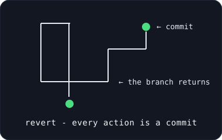

# revert

> **git for AI agent actions — every action is a commit, anything can be rolled back.**

<p align="center">
  
</p>

[](https://github.com/revert-labs/revert/actions/workflows/ci.yml)
[](https://github.com/revert-labs/revert/security/code-scanning)
[](LICENSE)
[](https://github.com/revert-labs/revert/issues)
[](https://github.com/revert-labs/revert/pulls)

Revert makes AI agent failures **survivable**. Agents are probabilistic — they will
eventually do something *plausible but wrong*: delete the wrong row, email the wrong
person, approve the wrong invoice. You can't make them 100% reliable (85% per step × 10
steps ≈ 20% end-to-end). So you make failure survivable instead: every agent action is
recorded as an immutable, replayable event — and anything can be rolled back.

## Why this exists

| The problem | The response |
|---|---|
| No rollback — the action happened in the real world | Automatic inverse operations (tiers 1–3) |
| No audit trail — agents log "I did X", not *how* | An event-sourced action ledger |
| No containment — one bad action cascades | Undo enough that the mistake can't cascade |
| No learning — the same mistake tomorrow | Replay-or-fork restore semantics |

## The three layers

1. **The Intercept** — an SDK that wraps agent tool calls, capturing every action as a
   deterministic event: endpoint, payload, **before-image**, idempotency key, response,
   timestamp, causal chain. (Instrumentation, not interception — the OpenTelemetry model.)
2. **The Undo Engine** — classifies every action into reversibility tiers and generates
   inverse operations. Compensation is a *forward-moving event* — undo never erases history.
3. **The Timeline** — a git-like view of agent actions: branch points, state diffs,
   one-click revert to any step.

## Status

**v0.1 — SDK MVP in progress.** The org and repos are live; the SDK is being
scaffolded. Everything in `src/` is a stub until the first milestone lands.
See [`docs/vision.md`](docs/vision.md) for the product and
[`docs/roadmap.md`](docs/roadmap.md) for the 90-day plan.

## Repo layout

```
docs/
  vision.md                  — the product vision & five design decisions
  roadmap.md                 — the 90-day plan, phases, decision gates
  research/                  — sourced research (compensation patterns, ACRFence)
  adr/                       — architecture decision records
  branding/                  — logo (SVG + ASCII), style notes
src/                         — the SDK (ledger, tool wrapper, undo engine)
test/                        — node:test smoke tests, zero dependencies
```

## Quickstart

```bash
npm test          # run the smoke tests (zero deps, node:test)
```

## License

Apache-2.0. The open core. The enterprise layer (`revert-enterprise`) is a separate,
private repository.
